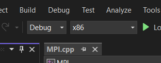

Descarcare:
- https://www.microsoft.com/en-us/download/details.aspx?id=105289
- ar trebui sa fie 2 fisiere care instaleaza pana la final

Configurare Visual Studio:
1. click dreapta proiect -> properties
2. C/C++ -> General -> Additional INclude Directories: C:\Program Files (x86)\Microsoft SDKs\MPI\Include
3. Linker ->General ->Additional Library Directories: C:\Program Files (x86)\Microsoft SDKs\MPI\Lib\x86  (pt 32 biti)
4. Linker -> Input->Additional Dependencies: msmpi.lib
APPLY :)

Steps pt compilare:
- sa fie de debun cu x86

- si dam pe sagetica verde

Steps pt rulare:
1. cd D:\Ariana\Facultate\SEM5\PPD\InLab\PPD_InClass3\MPI\Debug
2. mpiexec -np 4 MPI.exe
- 4 reprezinta nr de procese

